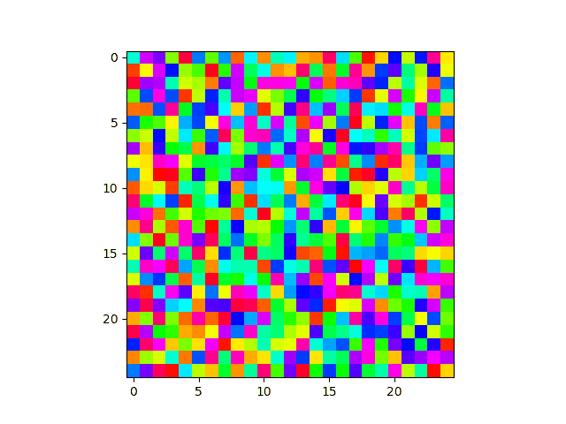

# Kuramoto Neurons

This repository holds code related to "Synchronization in phase-coupled Kuramoto oscillator networks with axonal delay and synaptic plasticity" <https://journals.aps.org/pre/abstract/10.1103/PhysRevE.89.032906>. It simulates emergent behavior of coupled oscillator networks with learning rules and time delays that more closely mimic the interactions between neurons in the brain than in traditional machine learning "neuronal network" based approaches.




It is currently split into 3 folders;

## Igor Pro

This folder contains a copy of the script, originally written circa 2013 for my undergraduate honors thesis and the publication above. It is a "procedure file" for a program called _Igor Pro_ which enabled easy and powerful visualization at the time but is, unfortunately, both locked-down/proprietary and obscure (relative to alternatives like MATLAB and Python). Those aspects limited the potential use of the code and direct exploration of the models by others. I also didn't know how to use `git`, `python`, etc. at the time, so the file here is just copied from surviving copies I had in an old backup. It is here just for the historical record.

## Rust

In August 2022, I translated the Igor Pro code to the Rust programming language. Doing so provides:

1. greater accessibility of the model since Rust is entirely open source (and I can provide pre-compiled binaries),
2. much faster execution with modern optimizations and C-like performance,
3. a project for me to learn Rust.

<!-- could modify program to take random seed for repeatability, need to specify seed or time to avoid overwriting runs, think about how to talk about and use g -->

To build the binary, one should [install the Rust toolchain](https://www.rust-lang.org/tools/install) and run

```bash
cargo build --release
```

inside the `kuramoto-rust` directory. That will create an optimized binary under the `target/release` subdirectory. The CLI parameters available for the program can then be listed via,

```bash
./release/kuramoto_rust -h
```

and the `kuramoto_rust` binary can then be copied anywhere on your system. Documentation isn't fully complete currently but is available under `target/doc/kuramoto_rust` and built with `cargo doc`.

## Python

This folder contains some simple python scripts for plotting and animating the resulting data files from the rust program.
